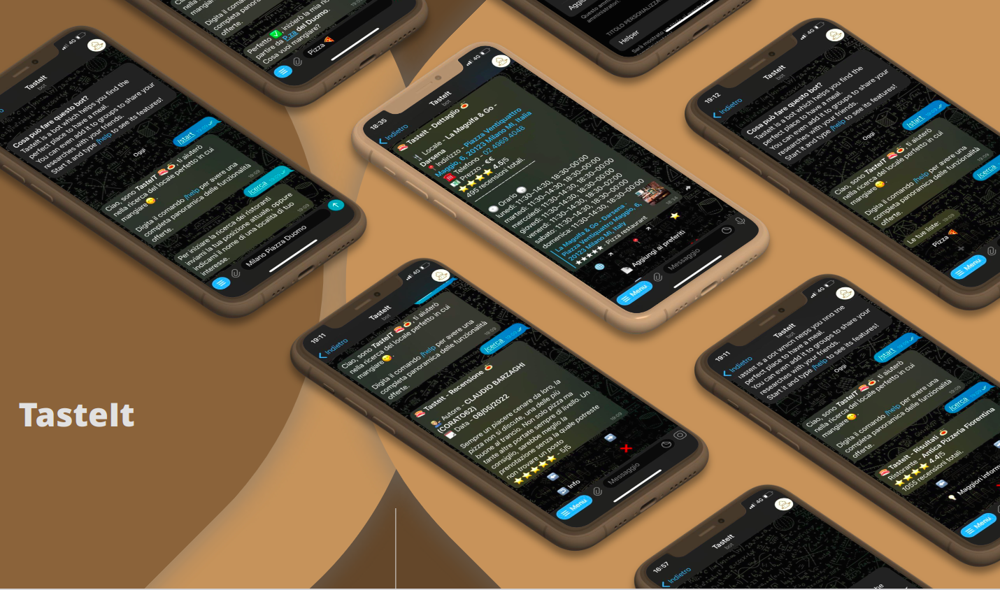
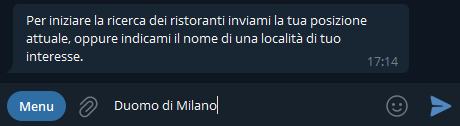
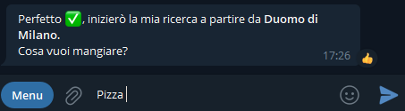
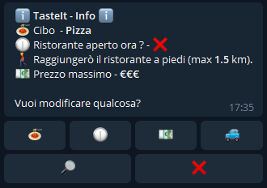
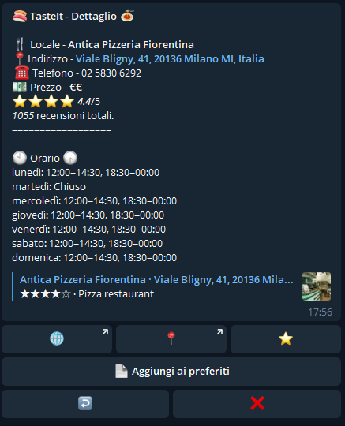
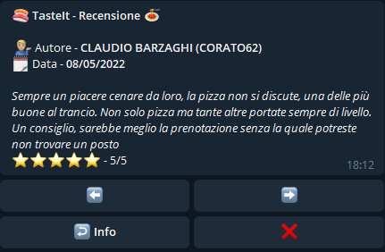
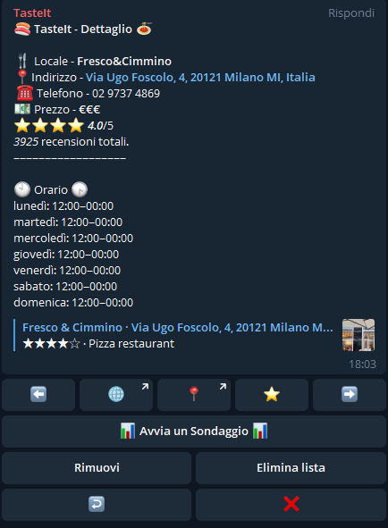

<div align="center">

  
  <h1>TasteIt</h1>
  
  <p>
    A Telegram bot to look for a perfect place to have a meal.
  </p>
  
  
<!-- Badges -->
<p>
  <a href="https://github.com/paolopertino/TasteIt/graphs/contributors">
    
  </a>
  <a href="">
    
  </a>
  <a href="https://github.com/paolopertino/TasteIt/network/members">
    
  </a>
  <a href="https://github.com/paolopertino/TasteIt/stargazers">
    
  </a>
  <a href="https://github.com/paolopertino/TasteIt/issues/">
    
  </a>
  <a href="https://github.com/paolopertino/TasteIt/blob/master/LICENSE">
    
  </a>
</p>
   
<h4>
    <a href="https://github.com/paolopertino/TasteIt/">View Demo</a>
  <span> · </span>
    <a href="https://github.com/paolopertino/TasteIt/blob/main/documentation/tasteit_report.pdf">Documentation</a>
  <span> · </span>
    <a href="https://github.com/paolopertino/TasteIt/issues/">Report Bug</a>
  <span> · </span>
    <a href="mailto:paolo.pertino@mail.polimi.it">Request Feature</a>
  </h4>
</div>

<br />

<!-- Table of Contents -->
# :notebook_with_decorative_cover: Table of Contents

- [About the Project](#star2-about-the-project)
  * [Screenshots](#camera-screenshots)
  * [Tech Stack](#space_invader-tech-stack)
  * [Features](#dart-features)
  * [Environment Variables](#key-environment-variables)
- [Getting Started](#toolbox-getting-started)
  * [Prerequisites](#bangbang-prerequisites)
  * [Installation](#gear-installation)
  * [Usage](#eyes-usage)
- [Contact](#handshake-contact)
- [Acknowledgements](#gem-acknowledgements)

  

<!-- About the Project -->
## :star2: About the Project
TasteIt is a telegram bot which helps you and your friend to find the perfect place to have a meal, based on what you want to eat, your price preferences, your current location and so on. Furthermore you can explore the reviews and detailed information about the restaurant you are visualizing with few clicks and you can add places you liked to favorites lists.

The bot has been built in order to make it usable by a single person or in a group of people interacting together. Find out more by trying it directly. 

<!-- Screenshots -->
### :camera: Screenshots

<div align="center"> 
  
</div>


<!-- TechStack -->
### :space_invader: Tech Stack

<details>
  <summary>Functionalities</summary>
  <ul>
    <li><a href="https://developers.google.com/maps/documentation/places/web-service/overview?hl=it">Google Places</a></li>
    <li><a href="https://www.mapbox.com/">Mapbox</a></li>
  </ul>
</details>

<details>
  <summary>Bot backbone</summary>
  <ul>
    <li><a href="https://www.python.org/downloads/">Python</a></li>
    <li><a href="https://python-telegram-bot.org/">python-telegram-bot</a></li>
  </ul>
</details>

<details>
<summary>Database</summary>
  <ul>
    <li><a href="https://docs.python.org/3/library/sqlite3.html">Sqlite3</a></li>
  </ul>
</details>

<!-- Features -->
### :dart: Features

- /start - Starts the bot and shows a welcome message to the user;
- /help  - Shows the list of available commands;
- /settings - Enables to modify some of the restaurant search settings; specifically it is possible to change the maximum number of meters we want to walk to reach the restaurant and the maximum number of meters we want to run across by car to reach the restaurant;
- /lang - Enables to change the language of the bot;
- /cerca - Starts the search for a restaurant;
- /preferiti - Shows the list of favorite restaurants either to the user or to the group;
- /annulla - Cancels the current operation;


<!-- Env Variables -->
### :key: Environment Variables

To run this project, you will need to add the following environment variables to your .env file

* `TELEGRAM_KEY` - The API key for the telegram bot;
* `TELEGRAM_DEVELOPER_CHAT_ID_KEY` - Id of the chat of the developer. Reported bugs through the bot will be sent to this chat;
* `DEV_TELEGRAM_KEY` - Optional, the API key for the telegram bot in development environment;
* `GOOGLE_PLACES_KEY` - The API key for accessing the google maps services;
* `MAPBOX_KEY` - The API key for accessing the mapbox services (routes calculations. Could be replaced by using an OpenStreetMap local server);

<!-- Getting Started -->
## 	:toolbox: Getting Started

<!-- Prerequisites -->
### Prerequisites

This project works using Python and PIP packet manager. Make sure you have them installed on your machine.

```bash
  python --version
  pip --version
```

<!-- Installation -->
### :gear: Installation

You can deploy this project on your machine by following these steps:

```bash
  git clone https://github.com/paolopertino/TasteIt.git
  cd TasteIt
  pip install -r requirements.txt
  <CREATE THE .env FILE AND UPDATE WITH YOUR API KEYS>
  python main.py
```

<!-- Usage -->
## :eyes: Usage
The chatbot can be used to look for places to have a meal. It has been developed to be used both in private and group chats.

|    |    |    |
|:--:|:--:|:--:|
|  |  | 

The chatbot allows to look for restaurants and respective information around the user current position or near a specified point of interest possibly filtering them for price range, distance from the user and how the user will reach the restaurant (by car vs walking for example). The information retrieved and displayed include the distance from the user/point of interest, the phone number, address, price range, and possibly reviews. 
|    |    |
|:--:|:--:|
|  | |

It is possible to create lists of preferences, keep track of the favorite restaurants and so subsequently retrieve easily their information.

|    |    |
|:--:|:--:|
|  | | 

<!-- Contact -->
## :handshake: Contact

Paolo Pertino - [@paolo-pertino](https://it.linkedin.com/in/paolo-pertino) - paolo.pertino@mail.polimi.it

Project Link: [https://github.com/paolopertino/TasteIt](https://github.com/paolopertino/TasteIt)


<!-- Acknowledgments -->
## :gem: Acknowledgements

Project directed by Paolo Pertino under the supervision of [Prof. Giovanni Agosta](https://www4.ceda.polimi.it/manifesti/manifesti/controller/ricerche/RicercaPerDocentiPublic.do?evn_didattica=evento&k_doc=6353&polij_device_category=DESKTOP&__pj0=0&__pj1=6ff6ab935c49114b3368c2ff5fb65b1c) at Politecnico di Milano.
